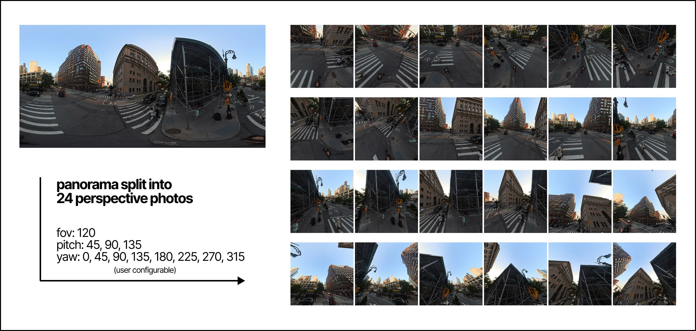
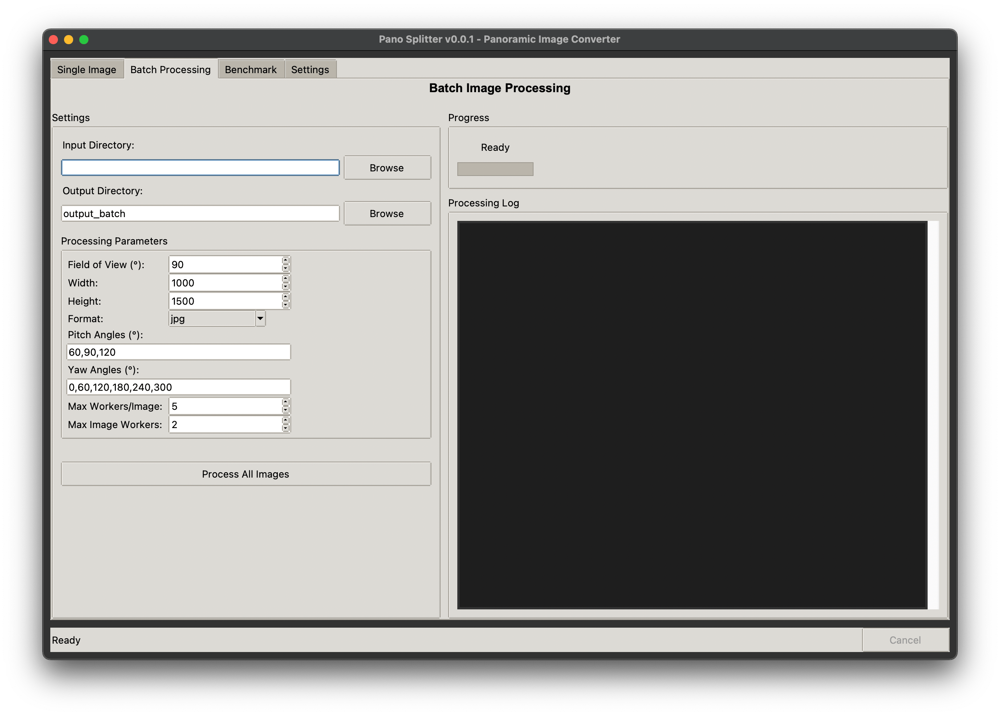

# Pano Splitter



Convert panoramic images to perspective views with parallel processing.

## Features

- **Fast OpenCV-based processing**: Faster CPU implementation (than numpy array wrangling) for equirectangular to perspective projection
- **Parallel Processing**: Multi-threaded processing for better performance
- **Batch Processing**: Process multiple images simultaneously
- **Flexible Output**: Support for PNG, JPG, and JPEG formats
- **GUI Available**: Easy-to-use graphical interface (see README_GUI.md)

## Installation

```bash
# Using uv (recommended)
uv sync

# Or with pip
pip install -r requirements.txt
```

## Quick Start

### Process Multiple Images

```bash
python pano_splitter.py \
    --input_path ./input_images \
    --output_path ./output_images \
    --list-of-pitch 60 90 120 \
    --list-of-yaw 0 60 120 180 240 300
```

### Process Single Image

```bash
python single_pano_splitter.py \
    --input_image ./my_panorama.jpg \
    --output_path ./output \
    --list-of-pitch 60 90 120 \
    --list-of-yaw 0 60 120 180 240 300
```

### Benchmark Performance

```bash
python tests/benchmark_performance.py \
    --input_image ./test_panorama.jpg \
    --num_perspectives 12
```

## Command Line Options

### Common Options

- `--max-workers`: Number of parallel threads (default: auto-detect)
- `--FOV`: Field of view in degrees (default: 90)
- `--output_width/--output_height`: Output dimensions
- `--output_format`: Output format (png, jpg, jpeg)

### Perspective Configuration

- `--pitch`: Single pitch angle (1-179 degrees)
- `--list-of-pitch`: Multiple pitch angles
- `--list-of-yaw`: Multiple yaw angles (default: [0, 60, 120, 180, 240, 300])

## Camera Angles

- **Pitch**: 1-179° (60°=up, 90°=horizon, 120°=down)
- **Yaw**: 0-360° (0°=front, 90°=right, 180°=back, 270°=left)

## Testing

```bash
# Run tests
PYTHONPATH=. uv run pytest tests/ -v

# With coverage
PYTHONPATH=. uv run pytest tests/ --cov=pano_splitter -v
```

## GUI Version



For a user-friendly graphical interface, see [README_GUI.md](README_GUI.md) or download the pre-built executable from releases.
